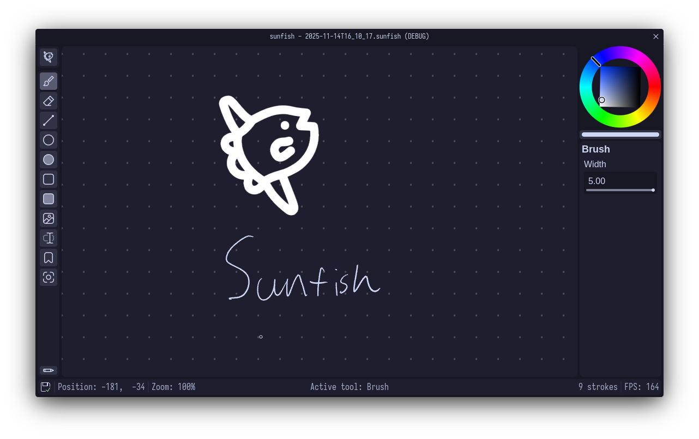

# sunfish



An infinite canvas whiteboard app.

## Why

sunfish was inspired by (the now unmaintained) [milton](https://github.com/serge-rgb/milton).
However, I didn't like its Dear ImGui-based GUI, and it lacked some features I wanted (like an image tool).
Since I couldn't find another good option, I decided to make my own.

## Features

Continuous saving: sunfish automatically saves your work during inactivity, so
you don't need to worry about unsaved work.

Many tools: sunfish has an extensive set of tools, including a plain brush,
raster eraser, line, circle, rectangle, image, text, and more.

High-resolution screenshots: sunfish can export PNGs of your canvas in up to
16384×16384 quality.

Heavily customizable: sunfish comes with many customization options out of the
box, and can be extended further with extra tools and themes with its plugin system.

## Plugins

To make a plugin, the first step is to clone this repository.
Open it in Godot, put resources like scripts inside the `plugins/` folder.

To export the plugin, use the "Plugin" export target.
This will give you a ZIP file that's installable through the plugins menu.

As a best practice, any resource that has a reverse-DNS ID (e.g. all of them)
should be placed inside a folder corresponding to its ID. For example, the
tool script shown below should be placed in `res://plugins/com/example/example_tool.gd`.

### Extra tools

The tools sunfish comes with out of the box are written the exact same way that
plugin-based tools are.
Each tool is defined by one script:

```gdscript
extends WhiteboardTool

# This will show up in the tool inspector
@export_range(1.0, 5.0, 0.0) var exported_property: float

# All tools are uniquely identified by a reverse-DNS notation ID
static func get_id() -> StringName: "com.example.ExampleTool"

# The default shortcut of this tool.
# The user can customize it in the shortcuts menu.
static func get_shortcut() -> InputEvent: return Shortcuts.key(KEY_T)

# Defaults to true.
# This should return a constant value of whether the mouse should be hidden when
# this tool is active.
func should_hide_mouse() -> bool: false

# Called whenever the whiteboard receives a GUI input
func receive_input(wb: Whiteboard, event: InputEvent) -> Display:
	var display := Display.new()
	# Elements are what get rendered to the whiteboard.
	display.elements = []
	# Preview elements are what get rendered above the whiteboard.
	display.preview_elements = []
	# Static preview elements are rendered above the whiteboard and don't get the
	# whiteboard transformation applied
	display.static_preview_elements = []
	# The cursor shape is... and you won't believe this... the cursor shape
	display.cursor_shape = Control.CURSOR_SHAPE_ARROW
	return display
```

Tools are automatically scanned for and registered by the `WhiteboardManager` as
long as they're inside the `res://plugins` folder.

### Configuration

sunfish's configuration system is built around scripts that extend `Configuration`:

```gdscript
extends Configuration


static func _static_init() -> void:
	PluginManager.register_configuration(new())

# Like tools, configurations get a unique identifier.
func get_id() -> StringName: return "com.example.ExampleConfiguration"

# Configurations have two places they can be serialized: CONFIG and LOCAL.
# CONFIG gets serialized to ~/.config/sunfish/settings.tres, and LOCAL
# gets serialized to ~/.local/share/sunfish/state.tres.
#
# CONFIG is better for actual configuration, and LOCAL is better for state things
# like last opened file, last used tool settings, etc.
func get_location() -> Location: return Location.CONFIG

# Add exported properties to have them show up in the settings window.
@export var value: int = 10

# export_storage can be used to hide the value from the settings window, but still
# store data. A configuration script only shows up in the settings window if it
# contains at least one visible (@export) property, but it gets serialized either
# way.
@export_storage var hidden_value: int = 15

# This is purely visual. InnerConfiguration will show up as a child of
# ExampleConfiguration in the settings window. It otherwise works the same.
@export var inner_configuration: InnerConfiguration


class InnerConfiguration:
	func get_id() -> StringName: return "com.example.ExampleConfiguration.InnerConfiguration"

	@export var inner_value: String = "hi"
```

You can retrieve the values from the `Settings` autoload:

```gdscript
var config_value = Settings["com.example.ExampleConfiguration/hidden_value"]
var inner_value = Settings["com.example.ExampleConfiguration.InnerConfiguration/inner_value"]
```

### Themes

Themes are much simpler than the other two. To make a theme, just make a
ThemeColors resource in the filesystem, set its ID and name accordingly, and
change its colors to your liking.
